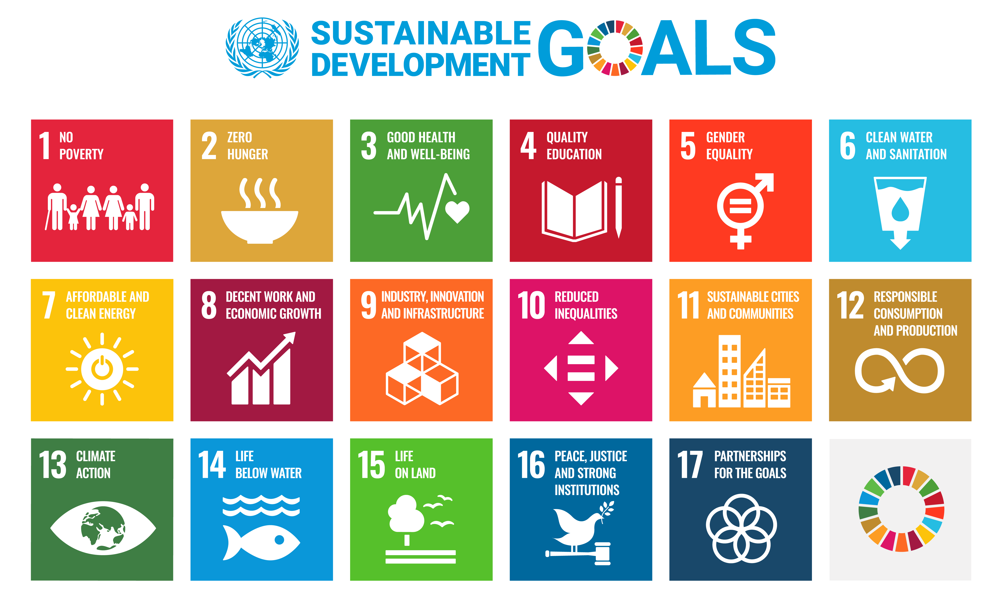
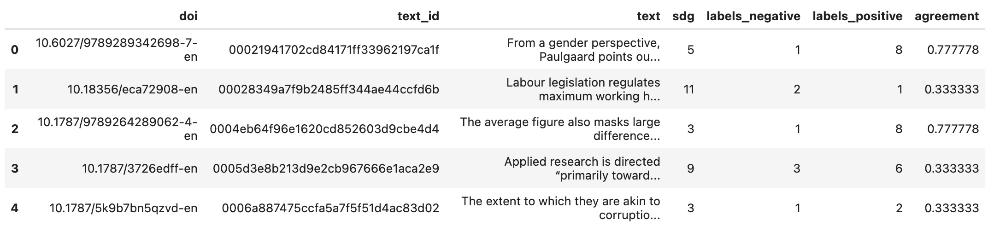
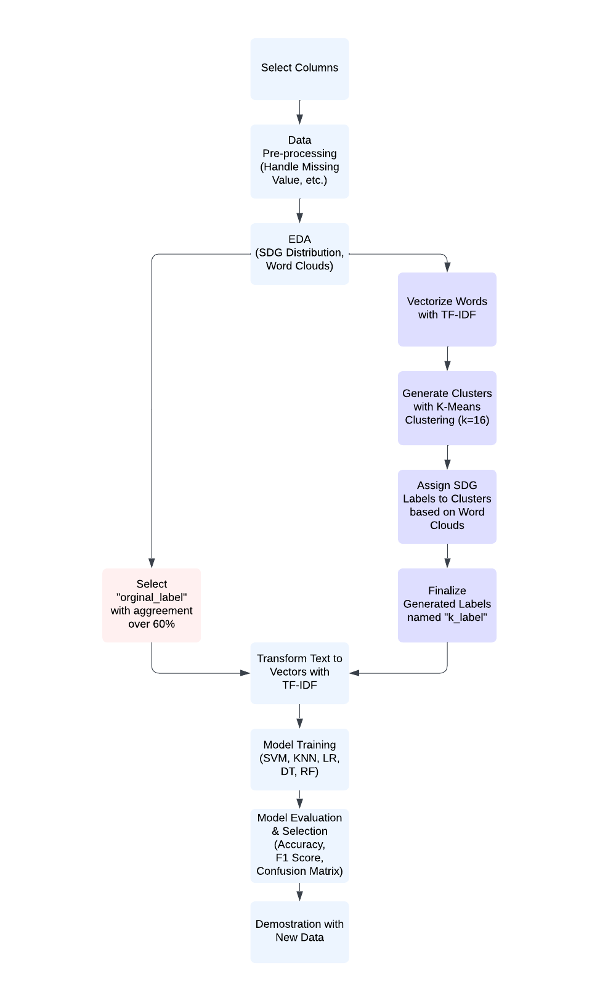

# DATA 245 Project
# Building SDG Classifier: Monitor the Process of the SDGs using Machine Learning

**
Group member:
**   

Angel Ren 016729557

Bertha Tam 012313600

Johnny Qiu 016237780

Manyu Zhang 016718858

Yuan Pan 016102138 

***
## Abstract
The Sustainable Development Goals (SDGs) were introduced by the United Nations in 2015, but recent reports show that the world has made no progress towards achieving them for two consecutive years due to various crises. To monitor the impact of the SDGs, data providers are called to develop innovative forms of data to assist in SDG impact monitoring.

Researchers have studied this topic with SDG-related documents. However, none of the methods used are fully capable of managing the SDGs since each project or financial aid could assist in the development of multiple SDGs.

This paper aims to demonstrate the need for multi-label datasets for SDG documents and generate insights for multi-labeling to save human effort. The multi-class dataset used is from the OSDG Community Dataset (OSDG-CD), and two sets of labels are used for this project. One is provided by OSDG-CD, and the other is generated by the authors using Term Frequency Inverse Document Frequency (TF-IDF) and K-Means Clustering.

The paper builds ten multi-class classifiers with a combination of five algorithms, including Support Vector Machines, K-Nearest Neighbors, Logistic Regression, Decision Trees, and Random Forest, and two label sets. Two SVM classifiers are selected after evaluating their performance with Accuracy, F1 Score, and Confusion Matrix. The SVM classifiers built with original labels and generated labels achieved 84% and 92% accuracy respectively.

This paper successfully demonstrates that one text can belong to multiple SDGs. By providing a framework for multi-label classification, this work can potentially advance multi-labeling and policymaking on the SDGs.

**Keywords: Sustainable Development Goals, Machine Learning, Multi-class Classification, Clustering**

***
## Dataset
We have selected the OSDG Community Dataset containing SDG labels being validated by Community Platform scientists. It contains text passages extracted from reports, policy papers, and abstracts of publications.The dataset is usually updated once every three months, and we used the newest version published on Apr 2023.

Each text passage has approximately 90 words. The SDG labels were validated by over 1,400 Community Platform scientists. The dataset is usually updated once every three months, and we used the newest version published on Apr 1st, 2023 .

https://zenodo.org/record/5550238

***
## Methodology
While each text can be related to multiple SDGs, each data instance was assigned a single SDG from the dataset. To better address this multi-label classification problem, we generated a new labeled dataset from our original dataset. We used TF-IDF to convert the texts to vectors and applied k-means clustering with a hyperparameter k of 16. After examining the word clouds generated from the clustering, we manually assigned SDG labels to those clusters and generated a 15 labeled dataset from the metadata.

With two different labeled datasets on hand, we trained five multi-classification classifiers and compared their performance using accuracy, F1 score and confusion matrix. Finally, we selected the better model and tested it on new text scripts.
